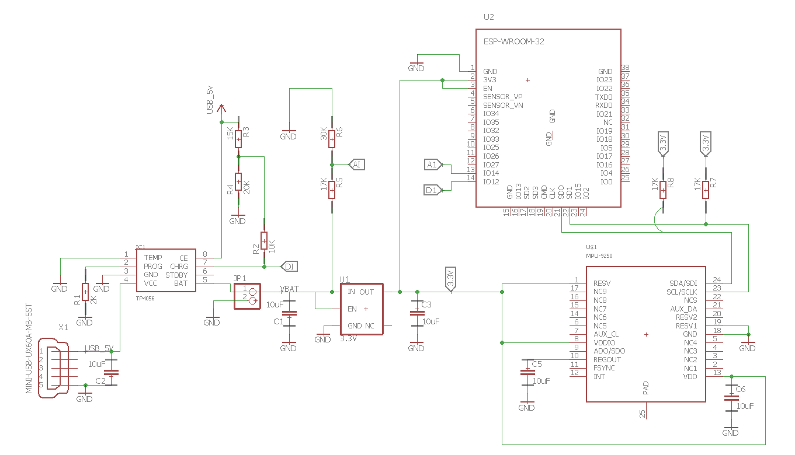

# MediSense

Repo to house the information relating to my teams implementation for the [AWS IoT App Hackathon](https://awsiot.devpost.com). Code and specific setup instructions can be found in [t04glovern/esp32-mqtt-publish](https://github.com/t04glovern/esp32-mqtt-publish) .

## Setup Guide

### ESP32 / ESP8266

#### Schematic


#### Flashing

Our design utilizes a ESP32 or ESP8266 microcontroller. The code we used to flash our board can be found in the [t04glovern/esp32-mqtt-publish](https://github.com/t04glovern/esp32-mqtt-publish) repository.

More indepth instructures can be found in that projects README, however the outcome from flashing that code to your board will be a stream of data similar to the following (depending on your personal configuration).

```bash
ntp [Connected]
aws [Connected]
aws-sub [Connected]
accl [Connected]
aws-pub [Success]: {"thing_id":"thing-01","timestamp":1510856411,"accl_x":-0.857124,"accl_y":3.351882,"accl_z":15.05474,"accl_mag":15.44717,"accl_fft":[1.479036,0.612483,0.850653,0.894927,0.906535,0.942905]}
aws-pub [Success]: {"thing_id":"thing-01","timestamp":1510856412,"accl_x":0.684742,"accl_y":2.169147,"accl_z":16.08904,"accl_mag":16.24903,"accl_fft":[0.699518,0.672761,0.895605,0.908498,0.956246,0.956738]}
aws-pub [Success]: {"thing_id":"thing-01","timestamp":1510856413,"accl_x":-1.120486,"accl_y":0.445322,"accl_z":13.00051,"accl_mag":13.05631,"accl_fft":[2.676121,0.61359,0.800661,0.848166,0.870695,0.904833]}
aws-pub [Success]: {"thing_id":"thing-01","timestamp":1510856415,"accl_x":-0.263362,"accl_y":-0.138864,"accl_z":13.2543,"accl_mag":13.25764,"accl_fft":[0.40734,0.631146,0.803048,0.868581,0.884759,0.895562]}
```

The JSON playload being printed to serial is the payload sent to AWS IoT over its MQTT provider.

### NodeRed

#### Flow

The Flow file for this configuration can be found in [misc/AWS-SpasmTracker](misc/AWS-SpasmTracker)


Instructions for setting up NodeRed on an AWS Elastic Beanstalk Service can be found [here](https://nodered.org/docs/platforms/aws)


#### Dashboard
The NodeRed dashboard is the presentation layer of the system, converting the raw data into a visual historical representation of what's happened. With data being logged to a MongoDB instance, it's possible for more advanced analytics to be conducted.


## Alerts
Given how it's very difficult to determine whether a seizure is occurring by picking a threshold value in the time domain, we chose to use a Discrete Fourier Transform to analyse the signal in the frequency domain, focusing on the most likely human oscillations, the 1Hz to 8Hz region.


## Security
Using Amazon services to stream data from the devices ensures that confidential data is kept secure through its certificate based encryption, while [AWS HIPPA complaint cloud storage](https://aws.amazon.com/compliance/hipaa-compliance/)  means that patient data can be stored in secure scalable storage, with these two factors facilitating an easier path to HIPPA compliance.

##  Future Work
There are three real areas for future work.

 - Size
 - Power Consumption
 
### Size
Our Prototype is currently small, but it can be a lot smaller by reducing the "modules" into a PCB board, the schematics of which have already been designed using a [MPU-9250 accelerometer](https://www.invensense.com/wp-content/uploads/2015/02/PS-MPU-9250A-01-v1.1.pdf), [ESP-WROOM32 microcontroller](http://espressif.com/sites/default/files/documentation/esp-wroom-32_datasheet_en.pdf),  [TP4056 single cell charger](https://dlnmh9ip6v2uc.cloudfront.net/datasheets/Prototyping/TP4056.pdfa), [AMS117 3.3v voltage regulator](http://www.advanced-monolithic.com/pdf/ds1117.pdf) as well as a few discrete resistors and capacitors and other miscellaneous components.


Attempting to combine all of the modules on a single component is advantageous as it makes the device significantly thinner and smaller, allowing it to be less intrusive and more comfortable to wear. The current prototype layout is able to fit on a board that's 40mmx30mm.


### Power Consumption
 We reviewed some of the literature related to trying to power the device while it's attached to a person via a small peltier cooler, which generates power through the difference of temperature between its two sides but discovered quickly that the amount of power generated was going to be [negligible, with an expected harvesting of 30μW at a 15 Degree Celsius temperature difference](http://ieeexplore.ieee.org/abstract/document/5475111/) and wasn't worth the trade off of extra size and circuit complexity. Therefore instead of having the device even partially self powered, we needed to consider ways to minimize power consumption.
 
 The main method to reduce power consumption is to focus on the wireless radio part of the circuit, as there's a large difference between current consumption while transmitting (120mA) and not transmitting (15mA). Utilizing either the esp32s 4mb of flash memory or external EEPROM storage as a buffer to store data while the WIFI radio is turned off, then turn the radio on and send this data as a single burst.


